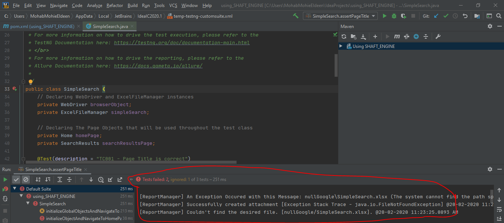
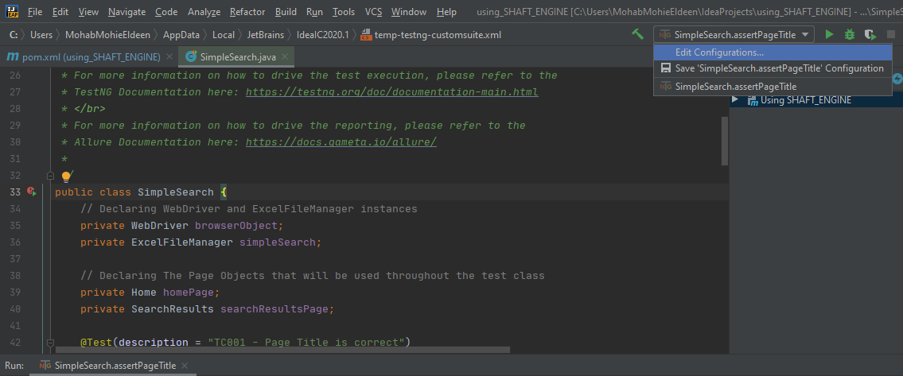
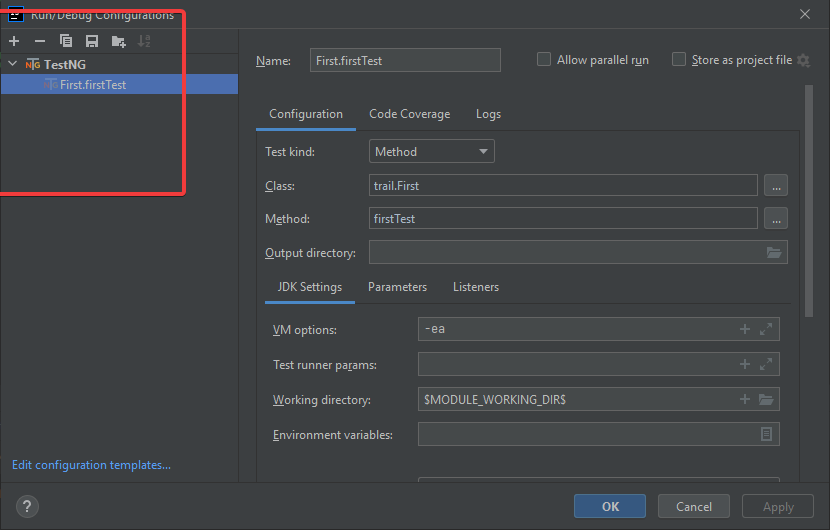
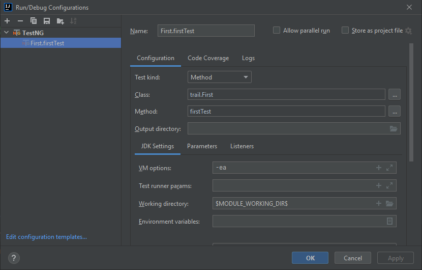
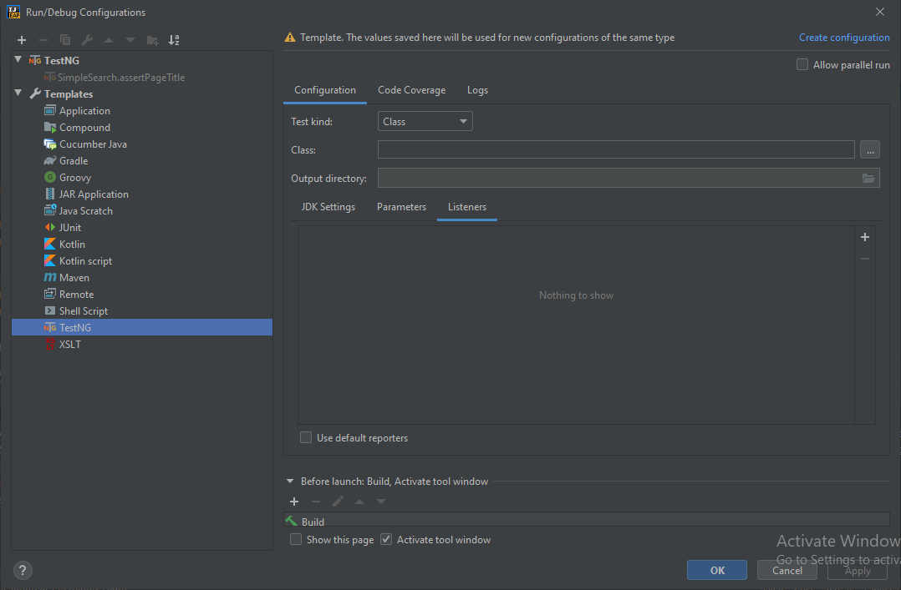
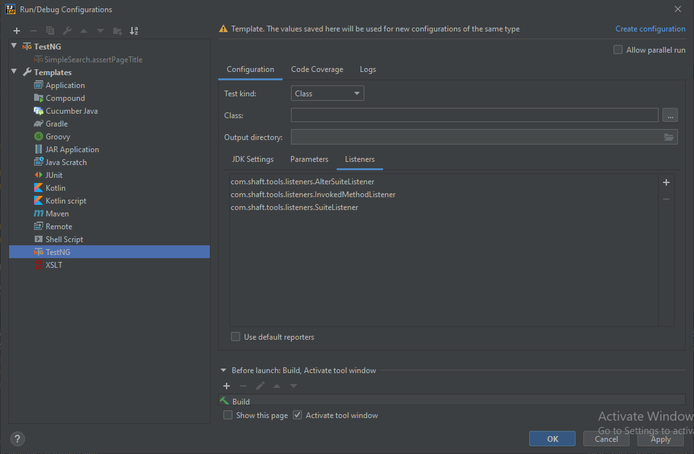
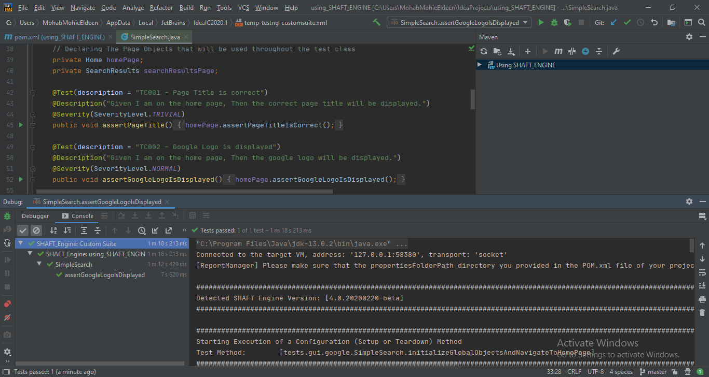

# using_SHAFT_ENGINE

**using_SHAFT_ENGINE** is a sample project to showcase how to get started using [SHAFT_Engine](https://github.com/MohabMohie/SHAFT_ENGINE/), and how to use some of its rich features, while applying the best practices for Test Automation project design. For a full list of the Supported features that you can use or try out, please refer to this [Read Me](https://github.com/MohabMohie/SHAFT_ENGINE/blob/master/README.md) file.

### Running your first sample test:

1. Simply import this project to your eclipse (or favorite JAVA IDE).
2. Watch this simple 5-minute live-demo:
   https://drive.google.com/file/d/1NxBpObvbBHdMjL4tl7PlpRNi7U9lMfW8/view

### Creating your own project based on using_SHAFT_ENGINE:

1. Make your own fork from the project 
2. Check out the Maven Projects from Git (File - Import - Maven -Check out Maven Projects from SCM)
   2.1. On the window that is presented click the link "Find more SCM connectors in the m2e Marketplace" in the bottom right corner of the page.
   2.2. Search for "m2e-egit" and install it, then restart and continue.
3. After your project is successfully imported, you can explore the file structure, and add your own tests or test suites as needed.

### Important Notes:

-   Always use the latest version of SHAFT_Engine in your pom.xml file

    
    
    

-   Refer to the published SHAFT_Engine javadocs for detailed information on the available functions/classes/packages https://mohabmohie.github.io/SHAFT_ENGINE/
-   Refer to TestNG [https://testng.org/doc/documentation-main.html] and Allure Reporting [https://docs.qameta.io/allure/] documentation for using annotations
-   Refer to the latest Sample Test Execution report for more info [https://mohabmohie.github.io/using_SHAFT_ENGINE/allure]

### IntelliJ:

-   As of SHAFT_Engine '4.0.20200220-beta' you can now use IntelliJ in addition to Eclipse to manage your test project.
-   After checking out the project to your IntelliJ you may face an exception that prevents tests execution.
-   In that case you need to add the SHAFT_Engine custom listeners to your TestNG execution template, as IntelliJ doesn't natively inherit this list from the pom.xml file.
-   Here are the steps you need to follow:

    -   This is the error that you may see 
    -   In that case you need to Edit your Run/Debug configuration 
    -   Delete the existing configurations 

    -   Click on Edit configuration template 

    -   Navigate to TestNG > Configuration > Listeners 
    -   Type com.shaft.tools.\* into your search box to find the required listeners and add them one by one 
    -   This is the desired output for your listeners configuration 
    -   Success! 
    -   Click on Edit configuration template 

    -   Navigate to TestNG > Configuration > Listeners 
    -   Type com.shaft.tools.\* into your search box to find the required listeners and add them one by one 
    -   This is the desired output for your listeners configuration 
    -   Success! 

## Debug issue

IntelliJ IDEA version 2021.3.1 and beyond might give exception error if you try to run in debug mode .In order to solve this issue go to this option windows : File -> Settings -> Build, Execution, Deployment -> Debugger -> Async Stack Traces and uncheck Instrumenting agent option.
